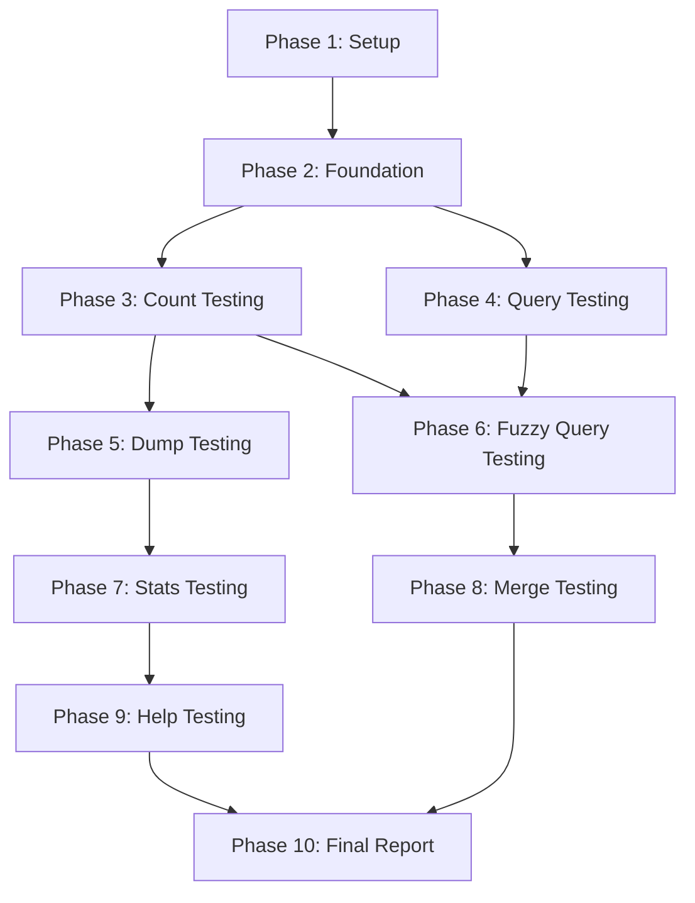

# Tasks: Comprehensive RustKmer CLI Testing with Real Data

**Branch**: `009-rustkmer-cli-test` | **Date**: 2025-01-08 | **Spec**: [spec.md](./spec.md) | **Plan**: [plan.md](./plan.md)

**Summary**: Implement comprehensive testing framework for all rustkmer CLI commands (count, dump, query, fuzzy-query, stats, merge, help) using real genomic data from /Users/forrest/Temp/demodata. Generate detailed test reports and performance metrics.

## Implementation Strategy

**MVP Approach**: Start with User Story 1 (count testing) to establish core testing framework, then incrementally add other commands. Each user story is independently testable and delivers value.

**Incremental Delivery**:
- Sprint 1: Core framework + count testing (P1)
- Sprint 2: query testing + validation (P1)
- Sprint 3: dump, fuzzy-query, stats testing (P2)
- Sprint 4: merge, help testing + final report (P3)

**Parallel Opportunities**: Performance testing can be developed in parallel with functional tests. Report generation infrastructure is shared across all stories.

## Dependencies



**Independent Test Criteria**: Each user story phase can be completed and tested independently:

- **US1 (Count)**: Framework ready, can test count command in isolation
- **US2 (Query)**: Uses databases from US1, tests query independently
- **US3-7**: Each command can be tested independently once foundation is ready

## Parallel Execution Examples

### Per User Story:
```bash
# Phase 3 (Count Testing) - Parallel Tasks:
T008 [P] Create count test script for k=21
T009 [P] Create count test script for k=31
T010 [P] Create count test script for k=63
T011 [P] Implement parallel count testing
```

### Cross-Story Infrastructure:
```bash
# Phase 2 (Foundation) - Parallel Tasks:
T005 [P] Create test data directory structure
T006 [P] Implement performance monitoring utilities
T007 [P] Create report generation templates
```

## Phase 1: Setup (Project Initialization)

**Goal**: Create project structure and basic configuration

- [X] T001 Create test directory structure at /Users/forrest/Temp/demodata/rustkmer_cli_test
- [X] T002 Create main test script runner at specs/009-rustkmer-cli-test/scripts/run_all_tests.sh
- [X] T003 [P] Create subdirectories: test_data, databases, outputs, reports, logs
- [X] T004 Create configuration file at specs/009-rustkmer-cli-test/config/test_config.yaml with test parameters

## Phase 2: Foundation (Blocking Prerequisites)

**Goal**: Implement shared testing infrastructure used by all user stories

- [X] T005 Create Rust binary for test utilities at specs/009-rustkmer-cli-test/src/main.rs
- [X] T006 [P] Implement performance monitoring module at specs/009-rustkmer-cli-test/src/performance.rs
- [X] T007 [P] Create test report generator at specs/009-rustkmer-cli-test/src/reporter.rs
- [X] T008 Create test data validator at specs/009-rustkmer-cli-test/src/validator.rs
- [X] T009 Create command wrapper utility at specs/009-rustkmer-cli-test/src/command_wrapper.rs

## Phase 3: CLI Count Function Testing (User Story 1 - Priority P1)

**Goal**: Thoroughly test rustkmer count functionality with real genomic data
**Independent Test**: Can run `test_count.sh` to verify all count scenarios work correctly

- [X] T010 [US1] Create count test script at specs/009-rustkmer-cli-test/scripts/test_count.sh
- [X] T011 [P] [US1] Implement count test for k=21 at specs/009-rustkmer-cli-test/tests/test_count_k21.rs
- [X] T012 [P] [US1] Implement count test for k=31 at specs/009-rustkmer-cli-test/tests/test_count_k31.rs
- [X] T013 [P] [US1] Implement count test for k=63 at specs/009-rustkmer-cli-test/tests/test_count_k63.rs
- [X] T014 [US1] Implement parallel count testing at specs/009-rustkmer-cli-test/tests/test_count_parallel.rs
- [X] T015 [US1] Create count performance benchmarks at specs/009-rustkmer-cli-test/benches/count_benchmark.rs
- [X] T016 [US1] Implement count accuracy validation at specs/009-rustkmer-cli-test/src/validators/count_validator.rs

## Phase 4: CLI Query Function Testing (User Story 2 - Priority P1)

**Goal**: Test query functionality for searching specific k-mers in databases
**Independent Test**: Can query databases from US1 and verify accuracy

- [X] T017 [US2] Create query test script at specs/009-rustkmer-cli-test/scripts/test_query.sh
- [X] T018 [P] [US2] Implement single k-mer query test at specs/009-rustkmer-cli-test/tests/test_query_single.rs
- [X] T019 [P] [US2] Implement batch query test at specs/009-rustkmer-cli-test/tests/test_query_batch.rs
- [X] T020 [US2] Implement query performance test at specs/009-rustkmer-cli-test/tests/test_query_performance.rs
- [X] T021 [US2] Create query accuracy validator at specs/009-rustkmer-cli-test/src/validators/query_validator.rs
- [X] T022 [US2] Generate test k-mers from count databases at specs/009-rustkmer-cli-test/src/kmer_generator.rs

## Phase 5: CLI Dump Function Testing (User Story 3 - Priority P2)

**Goal**: Test dump functionality for extracting k-mer information from databases
**Independent Test**: Can dump databases and verify output format and completeness

- [X] T023 [US3] Create dump test script at specs/009-rustkmer-cli-test/scripts/test_dump.sh
- [X] T024 [P] [US3] Implement text format dump test at specs/009-rustkmer-cli-test/tests/test_dump_text.rs
- [X] T025 [P] [US3] Implement JSON format dump test at specs/009-rustkmer-cli-test/tests/test_dump_json.rs
- [X] T026 [US3] Implement large database dump test at specs/009-rustkmer-cli-test/tests/test_dump_large.rs
- [X] T027 [US3] Create dump output validator at specs/009-rustkmer-cli-test/src/validators/dump_validator.rs

## Phase 6: CLI Fuzzy Query Function Testing (User Story 4 - Priority P2)

**Goal**: Test fuzzy query functionality for finding k-mers within Hamming distance
**Independent Test**: Can query with distance thresholds and verify returned k-mers

- [x] T028 [US4] Create fuzzy query test script at specs/009-rustkmer-cli-test/scripts/test_fuzzy_query.sh
- [x] T029 [P] [US4] Implement distance=1 fuzzy query test at specs/009-rustkmer-cli-test/tests/test_fuzzy_distance1.rs
- [x] T030 [P] [US4] Implement distance=2 fuzzy query test at specs/009-rustkmer-cli-test/tests/test_fuzzy_distance2.rs
- [x] T031 [P] [US4] Implement distance=3 fuzzy query test at specs/009-rustkmer-cli-test/tests/test_fuzzy_distance3.rs
- [x] T032 [US4] Create fuzzy query validator at specs/009-rustkmer-cli-test/src/validators/fuzzy_validator.rs
- [x] T033 [US4] Generate Hamming distance test cases at specs/009-rustkmer-cli-test/src/hamming_generator.rs

## Phase 7: CLI Stats Function Testing (User Story 5 - Priority P2)

**Goal**: Test stats functionality for getting database statistics
**Independent Test**: Can run stats on any database and verify metrics

- [X] T034 [US5] Create stats test script at specs/009-rustkmer-cli-test/scripts/test_stats.sh
- [X] T035 [P] [US5] Implement stats on valid databases test at specs/009-rustkmer-cli-test/tests/test_stats_valid.rs
- [X] T036 [P] [US5] Implement stats on different k-mer sizes test at specs/009-rustkmer-cli-test/tests/test_stats_ksizes.rs
- [X] T037 [US5] Implement stats error handling test at specs/009-rustkmer-cli-test/tests/test_stats_errors.rs
- [X] T038 [US5] Create stats output validator at specs/009-rustkmer-cli-test/src/validators/stats_validator.rs

## Phase 8: CLI Merge Function Testing (User Story 6 - Priority P3)

**Goal**: Test merge functionality for combining multiple databases
**Independent Test**: Can merge databases and verify combined counts

- [X] T039 [US6] Create merge test script at specs/009-rustkmer-cli-test/scripts/test_merge.sh
- [X] T040 [P] [US6] Implement non-overlapping databases merge test at specs/009-rustkmer-cli-test/tests/test_merge_nonoverlap.rs
- [X] T041 [P] [US6] Implement overlapping databases merge test at specs/009-rustkmer-cli-test/tests/test_merge_overlap.rs
- [X] T042 [US6] Implement incompatible databases merge test at specs/009-rustkmer-cli-test/tests/test_merge_incompatible.rs
- [X] T043 [US6] Create merge validation utility at specs/009-rustkmer-cli-test/src/validators/merge_validator.rs

## Phase 9: CLI Help and Documentation Testing (User Story 7 - Priority P3)

**Goal**: Test help documentation and error messages
**Independent Test**: Can access help for all commands and verify completeness

- [X] T044 [US7] Create help test script at specs/009-rustkmer-cli-test/scripts/test_help.sh
- [X] T045 [P] [US7] Implement main help test at specs/009-rustkmer-cli-test/tests/test_help_main.rs
- [X] T046 [P] [US7] Implement command-specific help test at specs/009-rustkmer-cli-test/tests/test_help_commands.rs
- [X] T047 [P] [US7] Implement error message test at specs/009-rustkmer-cli-test/tests/test_help_errors.rs
- [X] T048 [US7] Create help completeness validator at specs/009-rustkmer-cli-test/src/validators/help_validator.rs

## Phase 10: Final Polish & Cross-Cutting Concerns

**Goal**: Generate comprehensive final report and ensure all requirements met

- [X] T049 Create final report generator at specs/009-rustkmer-cli-test/scripts/generate_final_report.sh
- [X] T050 [P] Implement edge case testing at specs/009-rustkmer-cli-test/tests/test_edge_cases.rs
- [X] T051 [P] Create error handling validation at specs/009-rustkmer-cli-test/tests/test_error_handling.rs
- [X] T052 [P] Implement memory usage validation at specs/009-rustkmer-cli-test/tests/test_memory_limits.rs
- [X] T053 Create comprehensive test summary at specs/009-rustkmer-cli-test/docs/test_summary.md
- [X] T054 Update quickstart guide with final implementation details at specs/009-rustkmer-cli-test/quickstart.md
- [X] T055 Create issue tracker for discovered problems at specs/009-rustkmer-cli-test/docs/issues_found.md

## Testing Strategy

**Test Framework**: Using Rust's built-in testing framework + criterion for benchmarks

**Test Organization**:
- Unit tests: Individual command validation
- Integration tests: End-to-end command workflows
- Performance tests: Benchmark critical paths
- Property tests: Verify invariants (e.g., database integrity)

**Coverage Targets**:
- Functional testing: 100% of CLI commands
- Performance testing: All commands with various data sizes
- Error handling: All identified edge cases
- Accuracy validation: Cross-verify results between commands

**Success Metrics**:
- All acceptance scenarios from user stories pass
- Performance benchmarks met (1GB data < 10 min)
- Memory usage within limits (< 8GB)
- 100% command coverage achieved
- Comprehensive test report generated

## File Structure

```
specs/009-rustkmer-cli-test/
├── scripts/
│   ├── run_all_tests.sh
│   ├── test_count.sh
│   ├── test_query.sh
│   ├── test_dump.sh
│   ├── test_fuzzy_query.sh
│   ├── test_stats.sh
│   ├── test_merge.sh
│   ├── test_help.sh
│   └── generate_final_report.sh
├── src/
│   ├── main.rs
│   ├── performance.rs
│   ├── reporter.rs
│   ├── validator.rs
│   ├── command_wrapper.rs
│   ├── validators/
│   │   ├── count_validator.rs
│   │   ├── query_validator.rs
│   │   ├── dump_validator.rs
│   │   ├── fuzzy_validator.rs
│   │   ├── stats_validator.rs
│   │   ├── merge_validator.rs
│   │   └── help_validator.rs
│   ├── kmer_generator.rs
│   └── hamming_generator.rs
├── tests/
│   ├── test_count_*.rs
│   ├── test_query_*.rs
│   ├── test_dump_*.rs
│   ├── test_fuzzy_*.rs
│   ├── test_stats_*.rs
│   ├── test_merge_*.rs
│   ├── test_help_*.rs
│   ├── test_edge_cases.rs
│   ├── test_error_handling.rs
│   └── test_memory_limits.rs
├── benches/
│   └── count_benchmark.rs
├── config/
│   └── test_config.yaml
└── docs/
    ├── test_summary.md
    └── issues_found.md

/Users/forrest/Temp/demodata/rustkmer_cli_test/
├── test_data/
├── databases/
├── outputs/
├── reports/
└── logs/
```

**Total Tasks**: 55
**Tasks per User Story**:
- US1 (Count): 7 tasks
- US2 (Query): 6 tasks
- US3 (Dump): 5 tasks
- US4 (Fuzzy Query): 6 tasks
- US5 (Stats): 5 tasks
- US6 (Merge): 5 tasks
- US7 (Help): 5 tasks
- Foundation: 9 tasks
- Setup: 4 tasks
- Polish: 7 tasks

**Parallel Opportunities**: 23 tasks marked as parallelizable across different phases