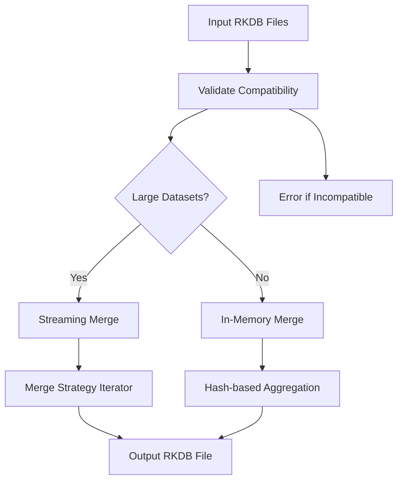

# Data Model: RKDB Database Merge

**Date**: 2025-12-08
**Source**: Feature Specification [spec.md](spec.md)
**Status**: Draft

## Core Entities

### 1. RKDB Database (RKDatabase)
The primary data structure representing a k-mer database.

```rust
pub struct RKDatabase {
    header: DatabaseHeader,
    kmer_data: Vec<KmerEntry>,
}
```

**Attributes**:
- `kmer_size`: Size of k-mers (21-64)
- `canonical`: Boolean flag for canonical mode
- `sorted`: Boolean flag for sorted state
- `total_kmers`: Total count of k-mers (including duplicates)
- `unique_kmers`: Number of unique k-mer sequences
- `encoding_format`: u64 or u128 encoding

**Relationships**:
- Contains multiple `KmerEntry` records
- Created by `merge_databases()` operation

### 2. K-mer Entry (KmerEntry)
Individual k-mer record with count information.

```rust
pub struct KmerEntry {
    kmer: u128,      // Encoded k-mer sequence
    count: u32,      // Occurrence count
}
```

**Attributes**:
- `kmer`: Encoded nucleotide sequence
- `count`: Number of occurrences (must fit in u32)

**Validation Rules**:
- `count` > 0
- `kmer` must be valid encoding for specified k-mer size

### 3. Merge Configuration (MergeConfig)
Configuration parameters for merge operations.

```rust
pub struct MergeConfig {
    max_memory_usage: usize,
    chunk_size: usize,
    temp_dir: PathBuf,
    use_streaming: bool,
    threads: usize,
    verbose: bool,
}
```

**Attributes**:
- `max_memory_usage`: Maximum memory to allocate (bytes)
- `chunk_size`: Processing chunk size for streaming mode
- `temp_dir`: Directory for temporary files
- `use_streaming`: Force streaming mode
- `threads`: Number of threads for parallel processing
- `verbose`: Enable detailed logging

**Default Values**:
- `max_memory_usage`: 50% of available system memory
- `chunk_size`: 1M k-mers
- `temp_dir`: System temp directory
- `use_streaming`: false (auto-detect)
- `threads`: Number of CPU cores
- `verbose`: false

### 4. Merge Statistics (MergeStats)
Runtime statistics for merge operations.

```rust
pub struct MergeStats {
    input_databases: Vec<String>,
    input_kmers: Vec<u64>,
    output_kmers: u64,
    unique_kmers: u64,
    merge_time: Duration,
    peak_memory: usize,
    strategy_used: MergeStrategy,
}
```

## Data Flow

### Merge Operation Flow



### State Transitions

| State | Trigger | Next State | Action |
|-------|---------|------------|--------|
| Initialized | Merge command called | Validating | Begin validation |
| Validating | All files valid | Strategy Selection | Choose merge strategy |
| Strategy Selection | Memory check | Merging | Begin merge operation |
| Merging | Completion complete | Completed | Save output database |
| Merging | Error occurred | Failed | Report error |
| Failed | Recoverable error | Strategy Selection | Try alternative strategy |

## Data Validation

### Input Validation Rules

1. **File Existence**: All input files must exist and be readable
2. **Format Validation**: Files must be valid RKDB format
3. **Compatibility Check**:
   - All databases must have same `kmer_size`
   - All databases must have same `canonical` mode
   - Encoding format must be compatible (u64/u128)

### Merge Validation Rules

1. **Count Accumulation**: Use checked addition to prevent overflow
2. **Memory Bounds**: Monitor memory usage during merge
3. **Output Validation**: Ensure sorted order in output database

## Performance Considerations

### Memory Management

```rust
// Efficient hash table for k-mer aggregation
type KmerTable = HashMap<u128, u32, BuildHasherDefault<AHasher>>;

// Memory-efficient streaming structure
pub struct StreamingMergeState {
    database_streams: Vec<DatabaseIterator>,
    current_window: VecDeque<(u128, u32)>,
    output_buffer: Vec<u8>,
}
```

### Parallel Processing Strategy

1. **Database Loading**: Load input databases in parallel
2. **K-mer Merging**: Parallel aggregation using map-reduce
3. **Output Writing**: Sequential write to maintain order

### Streaming Algorithm

For datasets exceeding memory limits:
1. Create sorted chunks from each database
2. Perform multi-way merge of sorted chunks
3. Use heap to track minimum values across chunks
4. Write merged results incrementally

## Error Model

### Error Hierarchy

```rust
#[derive(Debug, thiserror::Error)]
pub enum MergeError {
    #[error("Database compatibility error: {0}")]
    Compatibility(String),

    #[error("Insufficient memory: required {required}MB, available {available}MB")]
    InsufficientMemory { required: usize, available: usize },

    #[error("K-mer count overflow: kmer {kmer:x}, sum {sum} exceeds u32::MAX")]
    CountOverflow { kmer: u128, sum: u64 },

    #[error("I/O error during merge: {0}")]
    IoError(#[from] std::io::Error),

    #[error("Database corruption detected in {file}: {reason}")]
    Corruption { file: PathBuf, reason: String },

    #[error("Temporary file error: {0}")]
    TempFileError(String),
}
```

### Recovery Strategies

| Error Type | Recovery Strategy |
|------------|------------------|
| InsufficientMemory | Switch to streaming mode |
| IoError | Retry with exponential backoff |
| Compatibility | Fail fast with clear message |
| CountOverflow | Log warning and cap at u32::MAX |

## Optimization Opportunities

### Immediate Optimizations

1. **Pre-allocate HashMap** with estimated capacity
2. **Use `AHasher`** for better hash performance
3. **Batch I/O operations** with larger buffers
4. **Parallel database loading**

### Future Enhancements

1. **Compressed k-mer storage** in memory
2. **Persistent merge state** for resumable operations
3. **Distributed merge** for very large datasets
4. **Approximate merging** with error bounds